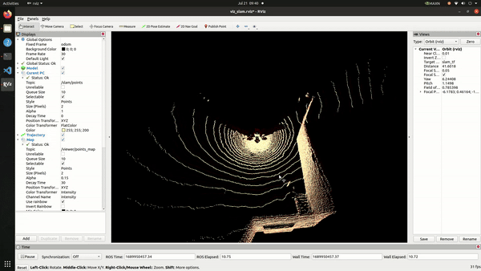
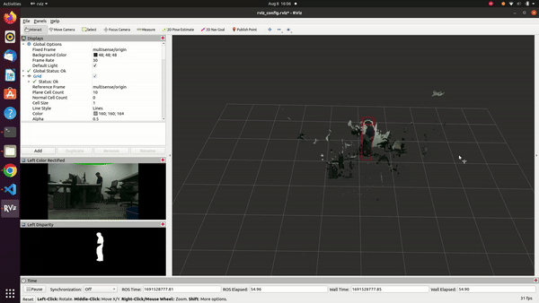

<!-- 
 -->

Hi! I'm Sasank Potluri, a robotics engineer pursuing MS in Robotics at Northeastern University. I am broadly interested in robust sensor fusion for safe autonomy, I currently work under Hanumanth Singh a Northeastern University Field Robotics Lab where my focus is on improving visual SLAM systems for autonomous robots. My work mainly focuses on visual-inertial navigation systems for high-speed autonomous navigation. My current projects include IMU Preintegration for Real-Time Visual-Inertial Odometry

I graduated with B.tech in Mechanical Engineering from Manipal Academy of Higher Education, Manipal. Prior to Northeastern I worked as a Research Assistant in Manipal University  on Water-lubricated Hydrodynamic bearings under Professor <a href="https://www.manipal.edu/mit/department-faculty/faculty-list/navaneeth-krishna-vernekar/_jcr_content.html">Navneeth Krishna Verneker</a>

During My Bachelor's I was part of a student project called <a href="https://www.formulamanipal.in/">Formula Manipal</a> that built small formula style race cars. I mainly worked on the structural design and manufacturing of Automobile Parts

I am passionate about pushing the boundaries of visual perception to enable reliable autonomy in the real world. You can view some of my work on <a href="https://github.com/sasank98">GitHub</a>. Please feel free to reach out to me. I will complete my MS in Robotics in April 2024 and continue pursuing my dream of developing autonomous systems that can operate safely and effectively in complex, unlabeled environments.

<!-- A data-driven personal website
======
Outside of my core research, I enjoy working on computer vision projects related to 3D scene view synthesis, image super-resolution and Diffusion Models. These include , stereo depth mapping, and more.
Like many other Jekyll-based GitHub Pages templates, academicpages makes you separate the website's content from its form. The content & metadata of your website are in structured markdown files, while various other files constitute the theme, specifying how to transform that content & metadata into HTML pages. You keep these various markdown (.md), YAML (.yml), HTML, and CSS files in a public GitHub repository. Each time you commit and push an update to the repository, the [GitHub pages](https://pages.github.com/) service creates static HTML pages based on these files, which are hosted on GitHub's servers free of charge.Many of the features of dynamic content management systems (like Wordpress) can be achieved in this fashion, using a fraction of the computational resources and with far less vulnerability to hacking and DDoSing. You can also modify the theme to your heart's content without touching the content of your site. If you get to a point where you've broken something in Jekyll/HTML/CSS beyond repair, your markdown files describing your talks, publications, etc. are safe. You can rollback the changes or even delete the repository and start over -- just be sure to save the markdown files! Finally, you can also write scripts that process the structured data on the site, such as [this one](https://github.com/academicpages/academicpages.github.io/blob/master/talkmap.ipynb) that analyzes metadata in pages about talks to display [a map of every location you've given a talk](https://academicpages.github.io/talkmap.html). -->

<!-- Getting started
======
1. Register a GitHub account if you don't have one and confirm your e-mail (required!)
1. Fork [this repository](https://github.com/academicpages/academicpages.github.io) by clicking the "fork" button in the top right. 
1. Go to the repository's settings (rightmost item in the tabs that start with "Code", should be below "Unwatch"). Rename the repository "[your GitHub username].github.io", which will also be your website's URL.
1. Set site-wide configuration and create content & metadata (see below -- also see [this set of diffs](http://archive.is/3TPas) showing what files were changed to set up [an example site](https://getorg-testacct.github.io) for a user with the username "getorg-testacct")
1. Upload any files (like PDFs, .zip files, etc.) to the files/ directory. They will appear at https://[your GitHub username].github.io/files/example.pdf.  
1. Check status by going to the repository settings, in the "GitHub pages" section

Site-wide configuration
------
The main configuration file for the site is in the base directory in [_config.yml](https://github.com/academicpages/academicpages.github.io/blob/master/_config.yml), which defines the content in the sidebars and other site-wide features. You will need to replace the default variables with ones about yourself and your site's github repository. The configuration file for the top menu is in [_data/navigation.yml](https://github.com/academicpages/academicpages.github.io/blob/master/_data/navigation.yml). For example, if you don't have a portfolio or blog posts, you can remove those items from that navigation.yml file to remove them from the header. 

Create content & metadata
------
For site content, there is one markdown file for each type of content, which are stored in directories like _publications, _talks, _posts, _teaching, or _pages. For example, each talk is a markdown file in the [_talks directory](https://github.com/academicpages/academicpages.github.io/tree/master/_talks). At the top of each markdown file is structured data in YAML about the talk, which the theme will parse to do lots of cool stuff. The same structured data about a talk is used to generate the list of talks on the [Talks page](https://academicpages.github.io/talks), each [individual page](https://academicpages.github.io/talks/2012-03-01-talk-1) for specific talks, the talks section for the [CV page](https://academicpages.github.io/cv), and the [map of places you've given a talk](https://academicpages.github.io/talkmap.html) (if you run this [python file](https://github.com/academicpages/academicpages.github.io/blob/master/talkmap.py) or [Jupyter notebook](https://github.com/academicpages/academicpages.github.io/blob/master/talkmap.ipynb), which creates the HTML for the map based on the contents of the _talks directory).

**Markdown generator** -->

<!-- I have also created [a set of Jupyter notebooks](https://github.com/academicpages/academicpages.github.io/tree/master/markdown_generator
) that converts a CSV containing structured data about talks or presentations into individual markdown files that will be properly formatted for the academicpages template. The sample CSVs in that directory are the ones I used to create my own personal website at stuartgeiger.com. My usual workflow is that I keep a spreadsheet of my publications and talks, then run the code in these notebooks to generate the markdown files, then commit and push them to the GitHub repository. -->

<!-- How to edit your site's GitHub repository
------

Example: editing a markdown file for a talk

For more info
------
More info about configuring academicpages can be found in [the guide](https://academicpages.github.io/markdown/). The [guides for the Minimal Mistakes theme](https://mmistakes.github.io/minimal-mistakes/docs/configuration/) (which this theme was forked from) might also be helpful. -->

Experience 
---------
<!-- * __Computer Vision Teaching Assistant, Khoury College of Computer Science__
    *  -->
* __Research Assistant, Silicon Synapse Lab, Northeastern University__
    * Implemented a closed loop MPC control on a snake robot using motor encoders and odometry from Motion Capture, to navigate in uneven surfaces 

    * Developed an end-to-end object detection and segmentation pipeline to annotate and train models and used it to compute pose of contact and dock 
    * Deployed the model on Nvidia Orin using docker, achieving real-time detection with a Realsense camera at 15 FPS and 3cm accuracy 
    * Generated Occupancy map by segmenting traversable point cloud in unstructured environments and utilized it for path planning 
    
      
* __Autonomy Systems and Machine Learning Co-op, Danfoss Autonomy__
    * Adapted LIO-SAM for a 6-axis IMU using additional GPS and conducted system testing to identify off-road failure modes
    * Performed system integration and testing along with FMEAs on third party SLAM companies for our specific off-road applications
      
    * Developed C++ code to provide ethernet communication between a SLAM controller and Danfoss controller
    * Implemented an additional decoder on unimatch network to parallelly compute Optic Flow, Stereo Disparity, and 3D detection
    * Achieved a 9.87 AP3D on Object detection task without fine-tuning the encoder of the unimatch network
      
    * Performed 3D-object detection using YOLO-v8 and DBSCAN on the colored pointcloud generated from LiDAR camera fusion
    * Leveraged synthetic data from Nvidia-IsaacSim to train YOLO-v8, achieved 0.45 mAP for real-world forklift detection
    * Pruned YOLO-v7 model to make it lighter and deployed on Adlink camera to detect Fruits, Trees and People in a farm

<!-- 

  <video width="320" height="240" controls loop>
    <source src="./images/personal/k_manoj.webm" type="video/webm">
    Your browser does not support the video tag.
  </video>

 -->

* __Research Assistant, Manipal Academy of Higher Education__
  * Added additional Pressure sensor to existing test-rig and acquired dynamic pressure and position readings using Matlab
  * Used the Data acquisition system to acquire the dynamics and stability of a water-lubricated hydrodynamic bearing
  * Created a 3D dynamic CFD model in Ansys and optimized it for stability using the collected bearing data

* __Structural Design and Manufacturing Engineer, Formula Manipal__
  * Performed dynamic simulation of a racecar on track in Matlab and used the data to design Suspension-links and Rims of the car
      
  * 3D-printed and added composite reinforcement to Intake-Manifold, achieving 50%+ weight reduction compared to prior versions
  * Designed and manufactured Carbon-fiber Seat, and Aero-package and won second place for design in Formula Bharat 2019
    

Projects 
---------

<html>
<head>
  
</head>
<body>
  

    
      

        
        <h2> {{ feature.title }}  <a href="{{ feature.url }}"><code>Github</code></a></h2> <!-- Add feature.url in href -->
        
{{ feature.excerpt }}

      

    
  

</body>
</html>