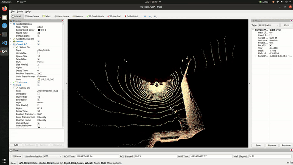
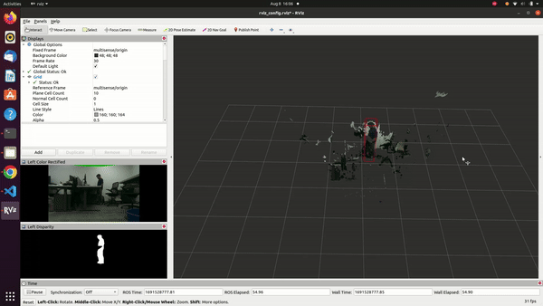

* __Research Assistant, Silicon Synapse Lab, Northeastern University__
    * Implemented a closed loop MPC control on a snake robot using motor encoders and odometry from Motion Capture, to navigate in uneven surfaces 

    * Developed an end-to-end object detection and segmentation pipeline to annotate and train models and used it to compute pose of contact and dock 
    * Deployed the model on Nvidia Orin using docker, achieving real-time detection with a Realsense camera at 15 FPS and 3cm accuracy 
    * Generated Occupancy map by segmenting traversable point cloud in unstructured environments and utilized it for path planning
     
      

* __Autonomy Systems and Machine Learning Co-op, Danfoss Autonomy__
    * Adapted LIO-SAM for a 6-axis IMU using additional GPS and conducted system testing to identify off-road failure modes
    * Performed system integration and testing along with FMEAs on third party SLAM companies for our specific off-road applications
    * Developed C++ code to provide ethernet communication between a SLAM controller and Danfoss controller
      
    * Implemented an additional decoder on unimatch network to parallelly compute Optic Flow, Stereo Disparity, and 3D detection
    * Achieved a 9.87 AP3D on Object detection task without fine-tuning the encoder of the unimatch network
      
    * Performed 3D-object detection using YOLO-v8 and DBSCAN on the colored pointcloud generated from LiDAR camera fusion
    * Leveraged synthetic data from Nvidia-IsaacSim to train YOLO-v8, achieved 0.45 mAP for real-world forklift detection
    * Pruned YOLO-v7 model to make it lighter and deployed on Adlink camera to detect Fruits, Trees and People in a farm

<!-- 

  <video width="320" height="240" controls loop>
    <source src="./images/personal/k_manoj.webm" type="video/webm">
    Your browser does not support the video tag.
  </video>

 -->

* __Research Assistant, Manipal Academy of Higher Education__
  * Added additional Pressure sensor to existing test-rig and acquired dynamic pressure and position readings using Matlab
  * Used the Data acquisition system to acquire the dynamics and stability of a water-lubricated hydrodynamic bearing
  * Created a 3D dynamic CFD model in Ansys and optimized it for stability using the collected bearing data

* __Structural Design and Manufacturing Engineer, Formula Manipal__
  * Performed dynamic simulation of a racecar on track in Matlab and used the data to design Suspension-links and Rims of the car  
  * 3D-printed and added composite reinforcement to Intake-Manifold, achieving 50%+ weight reduction compared to prior versions

      

  * Designed and manufactured Carbon-fiber Seat, and Aero-package and won second place for design in Formula Bharat 2019

    

